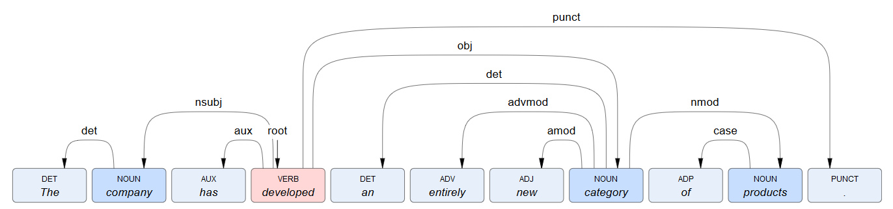

# Syntactic analysis

In the context of [deep linguistic analysis](../index.md), syntactic analysis is the <a href="https://en.wikipedia.org/wiki/Parsing#Human_languages" target="_blank">parsing</a> process that detects the <a href="https://universaldependencies.org/u/dep/index.html" target="_blank">universal dependency relation</a> between each [token](../subdivision/index.md) and the sentence _root_ token or another token.

The process assigns a dependency relation label to each token.  
For example, for this sentence:

	The company has developed an entirely new category of products.
	
syntactic analysis determines the head token index and the dependency label as follows:

Token index | Token text| Head token index | Universal dependency label
--- | --- | --- | ---
0 | `The` | 1 | `det`
1 | `company` | 3 | `nsubj`
2 | `has` | 3 | `aux`
3 | `developed` | 3 | `root`
4 | `an` | 7 | `det`
5 | `entirely` | 7 | `advmod`
6 | `new` | 7 | `amod`
7 | `category` | 3 | `obj`
8 | `of` | 9 | `case`
9 | `product` | 7 | `nmod`
10 | `.` | 3 | `punct`

Syntactic analysis output is part of the [JSON object returned by deep linguistic analysis](../../../reference/output/linguistic-analysis/index.md).  
Dependencies can be represented in <a href="https://en.wikipedia.org/wiki/Dependency_grammar#Representing_dependencies" target="_blank">various ways</a>, such as a tree or [arrow arcs](../../../reference/dependency-representation/index.md).

