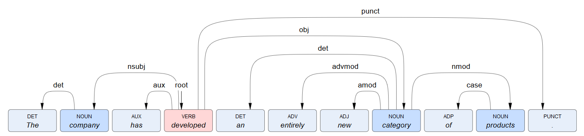

# Dependency representation

Here is an example of representing dependencies&mdash;the output of [syntactic analysis](../../guide/linguistic-analysis/syntactic-analysis/index.md)&mdash;with arrow arcs.

If you perform the [deep linguistic analysis](../../guide/linguistic-analysis/index.md) of this sentence:

	The company has developed an entirely new category of products.

you'll get a [response](../output/linguistic-analysis/index.md) like this:

``` json
{
	"content": "The company has developed an entirely new category of products.",
	"language": "EN",
	"tokens": [
		{
			"syncon": "noun.concepts.cause",
			"start": 0,
			"end": 3,
			"type": "ART",
			"lemma": "The",
			"pos": "DET",
			"id": 0,
			"head": 1,
			"dep": "det"
		},
		{
			"syncon": "noun.organization.company",
			"start": 4,
			"end": 11,
			"type": "NOU",
			"lemma": "company",
			"pos": "NOUN",
			"id": 1,
			"head": 3,
			"dep": "nsubj"
		},
		{
			"syncon": "noun.concepts.cause",
			"start": 12,
			"end": 15,
			"type": "AUX",
			"lemma": "has",
			"pos": "AUX",
			"id": 2,
			"head": 3,
			"dep": "aux"
		},
		{
			"syncon": "verb.general_action.develop",
			"start": 16,
			"end": 25,
			"type": "VER",
			"lemma": "develop",
			"pos": "VERB",
			"id": 3,
			"head": 3,
			"dep": "root"
		},
		{
			"syncon": "noun.concepts.cause",
			"start": 26,
			"end": 28,
			"type": "ART",
			"lemma": "an",
			"pos": "DET",
			"id": 4,
			"head": 7,
			"dep": "det"
		},
		{
			"syncon": "adv.manner.fully",
			"start": 29,
			"end": 37,
			"type": "ADV",
			"lemma": "entirely",
			"pos": "ADV",
			"id": 5,
			"head": 7,
			"dep": "advmod"
		},
		{
			"syncon": "adj.new",
			"start": 38,
			"end": 41,
			"type": "ADJ",
			"lemma": "new",
			"pos": "ADJ",
			"id": 6,
			"head": 7,
			"dep": "amod"
		},
		{
			"syncon": "noun.object_group.category",
			"start": 42,
			"end": 50,
			"type": "NOU",
			"lemma": "category",
			"pos": "NOUN",
			"id": 7,
			"head": 3,
			"dep": "obj"
		},
		{
			"syncon": "noun.concepts.cause",
			"start": 51,
			"end": 53,
			"type": "PRE",
			"lemma": "of",
			"pos": "ADP",
			"id": 8,
			"head": 9,
			"dep": "case"
		},
		{
			"syncon": "noun.artifact.products",
			"start": 54,
			"end": 62,
			"type": "NOU",
			"lemma": "product",
			"pos": "NOUN",
			"id": 9,
			"head": 7,
			"dep": "nmod"
		},
		{
			"syncon": "noun.concepts.cause",
			"start": 62,
			"end": 63,
			"type": "PNT",
			"lemma": ".",
			"pos": "PUNCT",
			"id": 10,
			"head": 3,
			"dep": "punct"
		}
	],
	"phrases": [
		{
			"tokens": [
				0,
				1
			],
			"type": "NP",
			"start": 0,
			"end": 11
		},
		{
			"tokens": [
				2,
				3
			],
			"type": "VP",
			"start": 12,
			"end": 25
		},
		{
			"tokens": [
				4,
				5,
				6,
				7
			],
			"type": "NP",
			"start": 26,
			"end": 50
		},
		{
			"tokens": [
				8,
				9
			],
			"type": "PP",
			"start": 51,
			"end": 62
		},
		{
			"tokens": [
				10
			],
			"type": "NA",
			"start": 62,
			"end": 63
		},
		{
			"tokens": [],
			"type": "CR",
			"start": 63,
			"end": 63
		}
	],
	"sentences": [
		{
			"phrases": [
				0,
				1,
				2,
				3,
				4,
				5
			],
			"start": 0,
			"end": 63
		}
	],
	"paragraphs": [
		{
			"sentences": [
				0
			],
			"start": 0,
			"end": 63
		}
	]
}
```

- Use the `tokens` array because it contains the dependency structure of the sentence.
- Create a box for each token.

	

- Label the box with the token text. This can be extracted from the value of the `content` property of the outer `data` object using the`start` and the `end` properties of the token.

	

- To decorate the box:
	- You can assign a color corresponding to the part-of-speech, that is the value of the `pos` property. For example, you can use pink for verbs, light blue for nouns, etc.
	
		

	- You can also put the part-of-speech tag as an additional label inside the box.
	
		

	- You can create a tooltip with the token's `lemma` property.
	
		

- Put a special mark over the token with the property `dep` set to `root`

	

- For all the non-root tokens, draw a dependency arc starting from the box of the token which `id` property value is equal to the value of `head` property.  
For example, if the current token has `head` = 3, start drawing the arc from the box of the token with `id` = 3 and put the arrow head in the current token's box.

	

- Decorate the arcs with the names of the dependencies you find in the `dep` property and you're done.

	[](final.png)